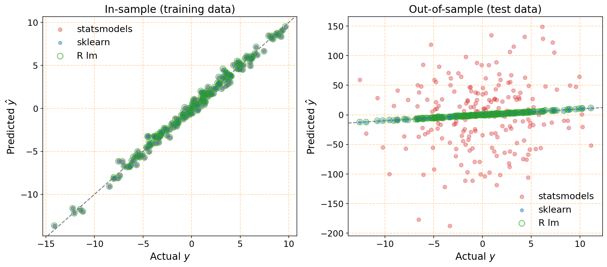
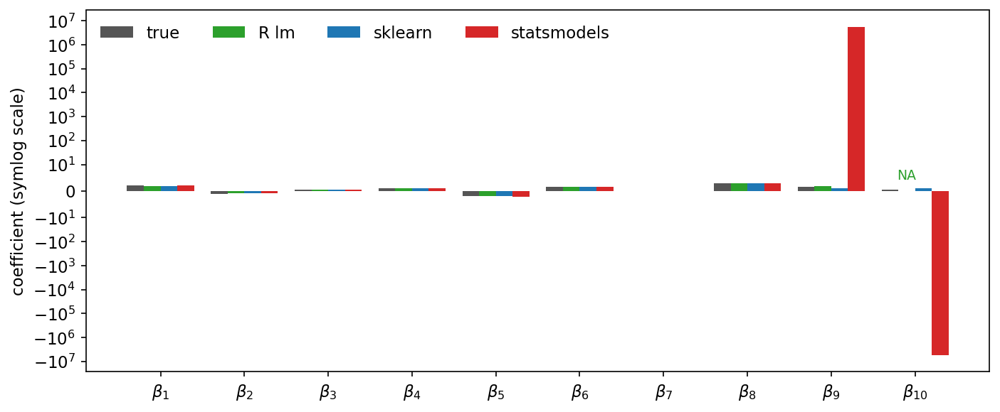

Richard Feynman once famously noted that "nearly everything is really
interesting if you go into it deeply enough."  I can't agree more.
Recently I had to revisit R for a project and I found it quite
interesting how R and Python, specifically, scikit-learn and statsmodels
handle linear regression in specific cases and the philosophy behind these
designs.

#### One dataset, three answers

Let's start with an experiment.  Suppose we have ten features, and the tenth
is almost a duplicate of the ninth.  This situation could easily arise when
dealing with datasets with many features.  In this experiment, we take it
to the extreme to make a point: in the training data the two columns
agree to about one part in $10^8$.  At test time the similarity has drifted
ever so slightly, to about one part in $10^5$. The data generating process
itself is perfectly well behaved.  It is linear in the features with true
coefficients $\beta$ and the noise are both at moderate levels.

```python
import numpy as np
import statsmodels.api as sm
from sklearn.linear_model import LinearRegression

rng = np.random.default_rng(42)
n, p = 200, 10
beta_true = np.array([2.0, -1.0, 0.5, 1.0, -2.0, 1.5, 0.0, 3.0, 1.5, 0.5])

def make_X(n, dup_scale):
    X = rng.standard_normal((n, p))
    X[:, 9] = X[:, 8] + dup_scale * rng.standard_normal(n)  # near-duplicate column
    return X

X_train = make_X(200, 1e-8)   # columns 9 and 10 agree to 1e-8
X_test  = make_X(200, 1e-5)   # the collinearity reduces to the scale of 1e-5
y_train = X_train @ beta_true + 0.5 * rng.standard_normal(200)
y_test  = X_test  @ beta_true + 0.5 * rng.standard_normal(200)

skl = LinearRegression(fit_intercept=False).fit(X_train, y_train)
ols = sm.OLS(y_train, X_train).fit()
```

We fit the same model in R on the exact same data with

```r
fit <- lm(y ~ . - 1, data = train)
```

Three implementations of the most classical (often misused) model in
statistics, one dataset.  Here is what comes back:

|              | in-sample $R^2$ | in-sample RMSE | out-of-sample RMSE |
| ------------ | --------------- | -------------- | ------------------ |
| R lm         | 0.98933         | 0.4768         | 0.5261             |
| scikit-learn | 0.98933         | 0.4768         | 0.5261             |
| statsmodels  | 0.98946         | 0.4739         | **57.60**          |

In sample, the three fits are so indistinguishable that you could stare at
residual plots all day and never tell them apart.  Out of sample, R and
scikit-learn sit right at the oracle error ($\sigma = 0.5$), while
statsmodels is off by two orders of magnitude:



Estimated coefficients get even more interesting.
The ground truth is $(\beta_9, \beta_{10}) = (1.5, 0.5)$, and the three
libraries return three incompatible stories:

|              | $\beta_9$ | $\beta_{10}$ |
| ------------ | --------- | ------------ |
| Truth        | 1.5       | 0.5          |
| R lm         | 1.925     | NA           |
| scikit-learn | 0.962     | 0.962        |
| statsmodels  | $+5.6 \times 10^6$ | $-5.6 \times 10^6$ |



R refuses to estimate $\beta_{10}$ at all: it reports `NA` and produces a
warning about a "rank-deficient fit" when you ask it to predict.
scikit-learn quietly splits the signal evenly between the twin columns.
statsmodels returns a gigantic pair of opposite-signed coefficients that
cancel almost perfectly in sample.  However, the moment the twin columns
disagree at the scale of $10^{-5}$ in the testing set, a coefficient of $5.6$
million amplifies that disagreement into prediction errors of around
$50$.

To understand what is going on, we first need to understand what the least squares solution even
*means* when $\bm{X}$ is, or is nearly, rank deficient.

#### The estimation problem

Linear regression proposes a linear relationship between the response
variable $Y \in \mathbb{R}$ and the explanatory variables $X \in \mathbb{R}^p$ with an
additive noise term $\epsilon\in \mathbb{R}.$  The relationship is specified by the
coefficient vector $\beta \in \mathbb{R}^p.$  That is,
$$
Y = X^\intercal \beta + \epsilon.
$$

Suppose one observes $n$ realizations $\{y_i, x_i\}_{i=1}^n$, which we will
denote by bold matrices notation
$$
\bm{Y} = [y_1, \dots, y_n]^\intercal \textrm{ and }
\bm{X} = [x_1, \dots, x_n]^\intercal.
$$

Linear regression (by ordinary least square) estimates
$\beta$ by solving
$$
\begin{align}
\argmin_{\beta \in \mathbb{R}^p} ||\bm{Y} - \bm{X}\beta||^2 \\ \tag{1}
\end{align}
$$

When $\bm{X}$ has full column rank, the solution is given by
$$
\hat{\beta} = (\bm{X}^\intercal\bm{X})^{-1}\bm{X}^\intercal\bm{Y}.
$$

R, scikit-learn, and statsmodels all reach the same conclusion.
However, it gets interesting when $\bm{X}$ is, or is close to, rank
deficient.  There are two principled ways to estimate $\beta$ without
introducing penalty in this case.

#### Approach 1: Minimum norm solution via pseudo inverse
We still solve the same problem as defined in (1).  The first order
condition is
$$
\frac{\partial}{\partial \beta} ||\bm{Y} - \bm{X} \beta||^2 = \bm{0}
\Rightarrow  \underbrace{\bm{X}^\intercal \bm{X}}_{\bm{A}} \beta = \underbrace{\bm{X}^\intercal \bm{Y}}_{\bm{B}}.
$$

For $\beta$ to be solvable, $\bm{B}$ should be in $col(\bm{A})$.
This is indeed the case since
$\forall \bm{v} \in ker(\bm{A}) = ker(\bm{X})$, one has

$$
\bm{B}^\intercal \bm{v} = \bm{Y}^\intercal \bm{X} \bm{v} = 0.
$$
Therefore, $\bm{B} \in ker(\bm{A})^\perp = col(\bm{A})$, where the last
equality uses the symmetry of $\bm{A}$ (in general
$ker(\bm{A})^\perp = col(\bm{A}^\intercal)$).  This implies
the solution set of $\beta$ is not null.  Next, since
$rank(\bm{A}) = rank(\bm{X}) = r < p$, for any two solutions $\beta$ and $\beta'$
that satisfy the normal equations above, one has
$$
\bm{A}(\beta - \beta') = 0 \Rightarrow \beta - \beta' \in ker(\bm{A}).
$$

Therefore, we can write the solution set of (1) as
$$
S = \{\beta \vcentcolon= \beta^* + \beta_k \mid \bm{A}\beta^* = \bm{B}, \beta_k \in ker(\bm{A})\}.
$$

This result makes a lot of sense since in rank deficient case anything in the kernel
does not impact the objective function, so one gets infinitely many solutions. To
get one solution, additional constraints are needed.  A popular one is the minimum
norm requirement.  That is, one tries to solve for 
$$
\begin{aligned}
\argmin_{\beta \in \mathbb{R}^p} ||\beta||^2\\
\textrm{subject to }\bm{A} \beta = \bm{B}\\
\end{aligned}
$$

One can use standard optimization technique to solve it, e.g., Lagrange multiplier.
Here we provide a more intuitive argument.  Notice that we can equivalently solve for
$$
\begin{aligned}
\argmin_{\beta_k \in ker(\bm{A})} ||\beta^* + \beta_k||^2\\
\end{aligned}
$$

Notice that
$$
\frac{\partial}{\partial \beta_k} \left[ (\beta^*)^\intercal \beta^* + 2 (\beta^*)^\intercal \beta_k + \beta^\intercal_k \beta_k \right]
= 2 \beta^* + 2 \beta_k.
$$

At optimal point, this derivative should be orthogonal to any element in $ker(\bm{A})$, that is,
$$
\bm{v}^\intercal (\beta^* + \beta_k) = 0, \quad \forall \bm{v} \in ker(\bm{A}).
$$

This condition implies that $\beta = \beta^* + \beta_k$ must lie entirely in $col(\bm{A})$.
That is, for the non-consequential component in the solution that lives in the kernel of $\bm{A}$,
we simply get rid of it and only keep the part that lives in the range of $\bm{A}$.

So how can we find such a solution?  Notice that since $\bm{A}$ is self-adjoint it admits
the eigen decomposition $\bm{A} = \bm{Q} \bm{D} \bm{Q}^\intercal$, where $\bm{Q}$ is a
$p\times p$ orthonormal matrix and $\bm{D}$ is a diagonal matrix whose diagonal elements
are the (nonnegative) eigenvalues of $\bm{A}$, arranged in descending order with the
last $(p-r)$ elements being $0$.

$$
\begin{aligned}
\bm{A} \beta = \bm{B}\\
\Rightarrow \bm{Q} \bm{D} \bm{Q}^\intercal \beta = \bm{B} \\
\Rightarrow \bm{D} \underbrace{\bm{Q}^\intercal \beta}_{\tilde{\beta}} = \underbrace{\bm{Q}^\intercal \bm{B}}_{\tilde{\bm{B}}}.
\end{aligned}
$$

For $1 \leq i \leq r$, this forces $\tilde{\beta}_i = \tilde{\bm{B}}_i / \bm{D}_{ii}$.
For $r < i \leq p$, we have $\bm{D}_{ii} = 0$ and $\tilde{\bm{B}}_i = 0$, so the
equation leaves these $\tilde{\beta}_i$ free. It is the
minimum norm requirement, i.e., $\beta \in col(\bm{A})$, that sets these components
to zero.  Hence

$$
\tilde{\beta}_i = \begin{cases}
\tilde{\bm{B}}_i / \bm{D}_{ii}, & 1 \leq i \leq r \\
0, & r < i \leq p.
\end{cases}
$$

Finally,

$$
\beta = \bm{Q} \tilde{\beta}.
$$

In literature, this solution is usually represented in a one-line formula

$$
\beta = \bm{X}^+ \bm{Y},
$$
where $\bm{X}^+$ is the Moore-Penrose pseudo inverse.

#### Approach 2: QR decomposition based solution
In rank deficient case, we permute $\bm{X}$ by matrix $\bm{P}$
such that the QR decomposition of $\bm{X}$ is given by
$$
\bm{X}\bm{P} = \bm{Q} \bm{R},
$$
where $\bm{Q}$ is $n\times r$ orthonormal matrix and

$$
\bm{R} =
\begin{bmatrix}
\bm{R}_{11} & \bm{R}_{12}\\
\end{bmatrix},
$$
with $\bm{R}_{11}$ being an $r\times r$ upper triangular matrix and $\bm{R}_{12}$ being $r \times (p-r).$

First notice that any $\bm{v} \in col(\bm{X})$ can be represented as $\bm{v} = \bm{Q}\bm{c}$ where $\bm{c}$
is an $r$-vector.

The fitted vector $\hat{\bm{Y}} = \bm{X}\beta$ should have residual perpendicular to $col(\bm{X})$,
that is, for an **arbitrary** $\bm{c} \in \mathbb{R}^r$,
$$
\begin{aligned}
& (\bm{Q}\bm{c})^\intercal (\hat{\bm{Y}} - \bm{Y}) = 0\\
\Rightarrow & \bm{c}^\intercal \bm{Q}^\intercal \hat{\bm{Y}} = \bm{c}^\intercal \bm{Q}^\intercal \bm{Y} \\
\Rightarrow & \bm{Q}^\intercal \hat{\bm{Y}} = \bm{Q}^\intercal \bm{Y} \\
\Rightarrow & \bm{Q}^\intercal \bm{Q}\bm{R}\bm{P}^{-1}\beta = \bm{Q}^\intercal \bm{Y} \\
\Rightarrow & \bm{R} \underbrace{\bm{P}^{-1}\beta}_{\tilde{\beta}} = \bm{Q}^\intercal \bm{Y} \\
\Rightarrow & \begin{bmatrix}
\bm{R}_{11} \, \bm{R}_{12}
\end{bmatrix}
\begin{bmatrix}
\tilde{\beta}_1\\
\vdots\\
\tilde{\beta}_r\\
0\\
\vdots \\
0
\end{bmatrix} = \bm{Q}^\intercal \bm{Y},
\end{aligned}
$$

that is, we set $\tilde{\beta}_i=0$ for $i=r+1, \dots, p$, and solve for the rest of the $\tilde{\beta}$,
which has a unique solution denoted by $\bar{\beta}$.  Finally, $\hat{\beta} = \bm{P}\bar{\beta}$.

Note that this is a *different* member of the solution set than the
minimum norm solution of Approach 1. Instead of being orthogonal to the
kernel, it simply has zeros in the pivoted-out coordinates.  Both are
legitimate solutions for the original problem (1).

#### What each library actually does

Armed with the understanding of the two approaches, we can now name exactly
what each library
computed in the opening experiment.  The smallest singular value of our
training matrix is $s_{min} \approx 9.3 \times 10^{-8}$; relative to the
largest, $s_{min}/s_{max} \approx 4.4 \times 10^{-9}$.  The relative size
is what matters, because every library applies its cutoff as a multiple
of $s_{max}$.  Each library has to answer the same question about this
ratio: *is that zero?*

- **statsmodels** (0.14.6) implements Approach 1 literally: it forms the
  pseudo inverse of $\bm{X}$ via the SVD (`pinv_extended`, adapted from
  `numpy.linalg.pinv`), zeroing singular values below
  `rcond` $\times \, s_{max}$ with `rcond` $= 10^{-15}$.  Our
  $4.4 \times 10^{-9}$ is far above that line, so the design matrix is
  considered to have full column rank.
  Dividing by $s_{min} \approx 9.3 \times 10^{-8}$ is what manufactures
  the $\pm 5.6$ million pair.
- **scikit-learn** (1.9.0) also implements Approach 1, through
  `scipy.linalg.lstsq` (LAPACK's SVD-based `gelsd`, which returns the
  minimum norm solution).  But it passes `cond = tol`, and `tol` defaults
  to $10^{-6}$.  Our singular value is *below* that line, so that direction
  is zeroed, i.e., `skl.rank_` reports $9$, and the minimum norm solution splits
  the shared signal evenly between the twin columns, resulting in the values $(0.962, 0.962)$.
- **R's `lm`** implements Approach 2: Householder QR with column pivoting
  (LINPACK's `dqrdc2`), with default
  `tol = 1e-7`.  R never looks at singular values, instead, a
  column is pivoted out when its residual norm falls below `tol` times
  its original norm.  For our matrix, column 10 retains only
  $\sim 10^{-8}$ of its norm once column 9 is processed, so it is pivoted
  out, its coefficient is reported as `NA`, and prediction proceeds as if
  the feature never existed.


#### Why the in-sample fits are identical

All three estimates are least squares solutions.  In general, the
fitted vector of a least squares solution is the orthogonal projection of
$\bm{Y}$ onto the column space the solver decided to use.  R and
scikit-learn project onto a $9$-dimensional subspace as they deem the design
matrix to be rank deficient.
statsmodels projects onto all $10$ dimensions, but the extra dimension
captures little beyond noise, so the in-sample fits are nearly identical.

#### Why the coefficients and the out-of-sample errors differ

The coefficients differ because the three answers are three different
members of the solution family $S = \{\beta^* + \beta_k\}$ from Approach 1:

- scikit-learn picks the **minimum norm** member that is orthogonal to the
  near-kernel, hence the even $(0.962, 0.962)$ split;
- R picks the **sparse** member with $\beta_{10} = 0$ where all the shared
  signal lands on $x_9$, hence $(1.925, \texttt{NA})$;
- statsmodels picks the member that solves the normal equations *exactly*,
  which requires a component of size
  $|\bm{u}_{10}^\intercal \bm{Y}| / s_{min} \approx 0.5 / 10^{-7} \approx
  5.6 \times 10^6$ along the near-null direction, where $\bm{u}_{10}$ is
  the left singular vector of $\bm{X}$ paired with $s_{min}$.

Out of sample, the prediction error contributed by the redundant direction
is (coefficient along that direction) $\times$ (how strongly a test point
loads on that direction).  Our test data breaks the twin-column redundancy at the
$10^{-5}$ level, so statsmodels pays $5.6 \times 10^6 \times 10^{-5}
\approx 50$, which is why we see huge out-of-sample RMSE.

#### The philosophy behind each choice

It is tempting to rank the three libraries, but each behavior is a
coherent answer to a different question.

**statsmodels** is an inference tool.  It refuses to silently alter the
model you specified: you asked for ten coefficients, it estimates ten,
exactly as the textbook formula dictates, and it tells you the design is
ill-posed where a statistician would look for it: the model summary.
Acting on that is your job.

**R** comes from the same statistical tradition but makes the pragmatic
move. It detects the rank deficiency, removes it, and screams about it in
coefficient table by producing `NA` and the rank-deficiency warning at
prediction time.  An `NA` is basically saying
"this coefficient cannot be determined reliably from these data."

**scikit-learn** is a prediction machine.  Its goal is to return a
model that predicts well, not coefficients you can do inference on.
Therefore, it silently picks the stable minimum norm solution and
moves on. The rank decision is recorded in `rank_` for those
who look, but no warning is ever printed.


So yeah, Feynman was absolutely right.


